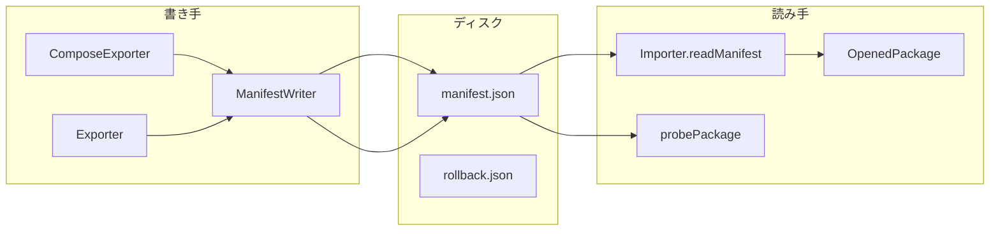

# dmig シリアライズデータ契約（アーキテクチャメモ）

**記録日**: 2026-05-26  
**きっかけ**: B-38（同一アプリで書き出したパックが E5002 で取り込めない）

## 問題の種類

| 追跡軸 | 見えるバグ | 見えにくいバグ |
|--------|-----------|----------------|
| UI → IPC → UI | B-01〜B-37（状態・ボタン・cancel） | — |
| ファイル上のデータ契約 | — | B-38（`dmigVersion` 意味のズレ） |

**教訓**: 「ユーザーの操作フロー」だけでは不十分。**書き手と読み手をファイル境界でペアにする**。

## 主要境界

## フィールド意味（manifest）

| フィールド | 書き手の意図（修正後） | 読み手の期待 |
|-----------|------------------------|--------------|
| `dmigVersion` | スキーマ識別 `1.1`（`DMIG_MANIFEST_VERSION`） | major === `1` |
| `schemaVersion` | `1.0` / `1.1` | partialState 等の分岐 |
| `source.appVersion` | 実行中アプリ版 | 表示・レポート用 |

**混同禁止**: `dmigVersion` ≠ `package.json` version。

## 防止策（優先度）

1. **ラウンドトリップテスト** — `manifestVersion.roundtrip.test.ts`（必須の最小形）
2. **共有定数** — `dmig/src/shared/manifestVersion.ts`
3. **仕様書同期** — `docs/dmig-manifest-1.1.md` と定数の定期 grep
4. （UPDATE-06）Zod / JSON Schema で書き手・読み手が同一定義を import
5. （中期）本ドキュメントの DFD を partialState / rollback に拡張

## AI 分析時のプロンプト例

- 「シリアライズされるデータについて、書き手と読み手が同じ仕様を共有しているか確認して」
- 「ラウンドトリップが成立するテストがどれだけあるか調べて」
- 「manifest 仕様書とコードの version 定数が一致しているか grep して」

## 関連

- Cursor ルール: `.cursor/rules/54-dmig-data-contracts.mdc`
- 通読ノート §19
