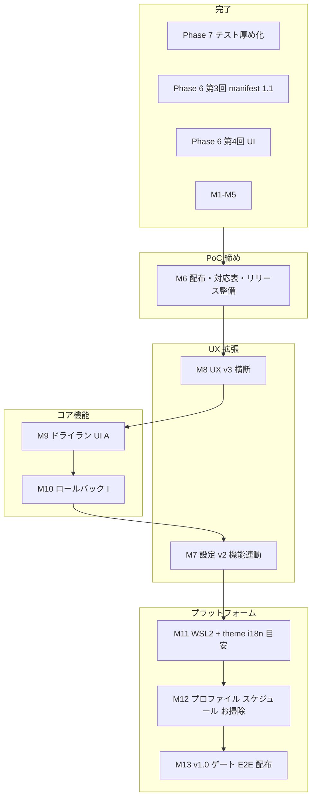

# M6–M13 マイルストーン全体設計（ロードマップ）

**記録日**: 2026-05-19  
**起点リリース**: `v0.3.0-poc`（Phase 7 テスト厚め化 + 第4回 UI + M1–M5 完了）  
**関連**: [M1–M5 実装ログ](./M1-M5-implementation-log.md)、[仕様書.txt](../../仕様書.txt) §9、[UI 再設計メモ](../dmig-ui-redesign-v0.1.md)

---

## 現在地（完了済み）

| ブロック | 内容 | 備考 |
|----------|------|------|
| Phase 7 | 中断・再開のテスト厚め（19 → 44 件規模） | `0.3.0-poc` CHANGELOG |
| Phase 6 第3回 | manifest 1.1 / `partialState` / 再開 UI | 正本 `docs/dmig-manifest-1.1.md` |
| Phase 6 第4回 | UI A → F → C → E → D（Step B 撤回） | 三層: Overview / Help / Footer+Indicator |
| M1–M5 | リリース整備・設定最小・UX v2・smoke | コミット `1983681` |

`CHANGELOG [Unreleased]` は空。次バージョンはマイルストーン着手時に積む。

---

## 確定方針（2026-05-19）

マスター見解を反映した **作業順の正史**（判断 ID は差し替え用）。

| ID | 論点 | 採用 |
|----|------|------|
| **D-009** | M シリーズ着手順 | **M6 → M8 → M9 → M10 → M7 → M11 → M12 → M13**（原案の M7 を M10 後へ後置） |
| **D-010** | 仕様書 Phase 番号の整理 | **案 B**: §9 の Phase は論理グルーピングのまま維持。実装作業順は M シリーズ。対応表を **M6 で追加**（仕様書 §9.1 + 本ドキュメント） |
| **D-011** | M6 のスコープ | 配布固定 + **Phase↔M 対応表**（コード変更は最小。`build:win` / Release / smoke） |
| **D-012** | M7 の位置づけ | M9/M10 で見えた設定項目を束ねる。**theme / i18n** は機能と独立した UX 改善のため **M11 前後** でまとめて入れる |

**M8 を M7 より先にする理由（要約）**: Step B 撤回時の「要件確定後に設定を新規設計」と整合。M3 最小 Settings は維持しつつ、D-004 等の第4回 UX 仕上げを先に閉じる。M9/M10 実装で具体的な永続化項目が増えてから M7 で束ねる。

**M6 を最優先する理由**: Release 本文で PoC の線を引く。M7 以降と並行すると Release が膨らみ続ける典型を避ける。

---

## ロードマップ（依存関係・確定順）

---

## マイルストーン一覧

| # | 名称 | 目的 | 主な成果物 | 依存 | 状態 |
|---|------|------|------------|------|------|
| — | Phase 7 | 中断・再開のテスト厚め | fixture + main テスト拡充 | R3 | **完了** |
| — | 第4回 UI | 地図・辞書・コンパス・現在地 | Overview / Help / Footer / Indicator | A | **完了** |
| — | M1–M5 | PoC 仕上げ | 設定最小・Lucide・smoke・`v0.3.0-poc` | 第4回 UI | **完了** |
| **M6** | 配布・リリース整備 | PoC を触れる形で固定 | Release notes、`build:win`、smoke、§9.1 確認 | M1–M5 | **完了**（2026-05-19、`v0.3.0-poc` タグは M1 時点） |
| **M8** | UX v3（横断） | M4 見送り・第4回仕上げ | D-004 / D-005、ログページ | M6 | **完了**（2026-05-19） |
| **M7** | 設定 v2 | 機能連動の設定束ね | 閾値・保持期間等 + `defaultExportDir` 配線。theme/i18n は M11 寄り | M10 | 未着手 |
| **M9** | ドライラン UI（A） | 仕様 S4 を GUI 統合 | Validator / preflight 横断 UI | M8 | **完了**（2026-05-19、`da8e404`） |
| **M10** | ロールバック（I） | 仕様 S12 | `rollback.json`、Import 後ロールバック UI | M9 推奨 | **完了**（2026-05-19、`b48e9ef`）。Resume Export `rollback.json` 追補（`7d4f6b0` / `f983eae` / `91c9cff`） |
| **M11** | WSL2 丸ごと（L） | Windows 専用 | 仕様書 Phase 8 | M10 前後可 | 未着手（事前論点: [m11-wsl2-prep-notes.md](./m11-wsl2-prep-notes.md)） |
| **M12** | 運用拡張（C/D/N） | プロファイル等 | 仕様書 Phase 9 | M11 以降 | 未着手 |
| **M13** | v1.0 ゲート | 製品化 | Playwright E2E、インストーラ、ユーザードキュメント | M6–M12 | 未着手 |
| — | Phase 11+ | Extension 化 | Docker Desktop Extension | v1.0 後 | 将来 |

---

## M6 — 配布・リリース整備（完了 2026-05-19）

| 項目 | 内容 |
|------|------|
| スコープ | GitHub Release 本文（バイナリなし可）、`build:win` 手動/CI、smoke 定着、**仕様書 §9.1 Phase↔M 対応表**（案 B） |
| 既存 | `scripts/run_smoke_check.py`、タグ `v0.3.0-poc`、`docs/testing/smoke-checklist.html` |
| 判断 | [D-002](./M1-M5-implementation-log.md) Release、[D-010](./M6-M13-roadmap.md) 対応表、[D-011](./M6-M13-roadmap.md) M6 スコープ |
| 成果物 | `docs/releases/v0.3.0-poc.md`、`docs/instructions/m6-release-prep-instructions.md` |
| タグ | `v0.3.0-poc` は M1–M5 時点で付与済み（M6 では付け替えなし） |

---

## M7 — 設定 v2（M10 後・M11 前後）

| 項目 | 内容 |
|------|------|
| スコープ | M9/M10 で見えた永続化項目の束ね、`defaultExportDir` の実運用配線 |
| スコープ（別枠） | **theme / i18n** — 機能と独立した UX 改善。**M11 前後** でまとめて入れる（D-012） |
| スコープ外 | Step B ウィザード復活 |
| 現状 | M3: `SettingsPage` + `dmig-settings.json`（`restoreLastPage` / `lastPage`） |
| 判断 | [D-003](./M1-M5-implementation-log.md)、[D-012](./M6-M13-roadmap.md) |

---

## M8 — UX v3（横断）（完了 2026-05-19）

| ID | 内容 | 状態 |
|----|------|------|
| D-004 | export / resume / import 完了時の Footer 動的 CTA | **完了** |
| D-005 | 共通ログビューア（1000 件 FIFO） | **完了** |
| — | Lucide ページ内（F2 / M13） | 見送り |
| — | `resume` flowStep | 現状維持（G1） |

---

## 仕様書 §9 Phase と M シリーズ（案 B・正史）

- **仕様書 Phase**: 設計上の論理グルーピング（§9 表は原則改変しない）。
- **M シリーズ**: 実装作業の時系列・リリース単位の正史。
- **重複注意**: 仕様書「Phase 6 = ドライラン・ロールバック」と、実績「Phase 6 = 第3回 manifest + 第4回 UI」は**別物**。混同時は本表を参照。

詳細表は [仕様書.txt §9.1](../../仕様書.txt)（M6 で追加）。

| 仕様書 Phase | 仕様書上の内容 | 実装マイルストーン / 実績 |
|--------------|----------------|---------------------------|
| 7 | B: 差分・再開（テスト厚め） | **完了**（Phase 7、`0.3.0-poc`） |
| 6（表の行） | A: ドライラン | **M9**（`preflight` 一部あり） |
| 6（表の行） | I: ロールバック | **M10**（`b48e9ef`） |
| — | （実績）manifest 1.1 + 再開 UI | Phase 6 第3回・**完了** |
| — | （実績）UI 第4回 A–F–C–E–D | Phase 6 第4回 + M1–M5・**完了** |
| 8 | L: WSL2 | **M11** |
| 9 | C/D/N | **M12** |
| 10 | E2E・インストーラ | **M13**（E2E 本体は D-006 見送り可） |

---

## 三層 UX の完成度

| 層 | 役割 | 状態 | 次 |
|----|------|------|-----|
| Overview | 地図 | 完了（C） | — |
| Help | 辞書 | 完了（F） | — |
| Footer | コンパス | 完了（E）+ M4 Docker 案内 | M8 D-004 |
| StepIndicator | 現在地 | 完了（D）+ M4 | `resume` flowStep 要否 |
| Settings | 環境 | 最小（M3） | **M7**（M10 後）、theme/i18n は **M11** 寄り |

---

## 着手順（確定）

**M6 → M8 → M9 → M10 → M7 → M11 → M12 → M13**（[D-009](#確定方針2026-05-19)）

各マイルストーン着手時は **設計 → `docs/milestones/` 記録 → 実装 → 開発日記**（M1–M5 と同型）。指示書は `docs/instructions/` に Step 単位で起こす。

---

## PoC UX バグ修正トラッキング（UPDATE-01 / UPDATE-02）

| ID | 内容 | 状態 |
|----|------|------|
| B-08, B-06, B-01, B-13, B-07, B-25, B-17, B-16, B-12, B-19, B-32, B-30, B-09, B-14, B-35, B-21 | Renderer 確証バグ | **完了 (0.3.1-poc)** |
| B-02 | Compose 常時マウント廃止 + `ComposePageStateContext` | **完了 (0.4.0-poc)** |
| B-10, B-11, B-31 | Rollback グローバル化 + `JobLockContext` | **完了 (0.4.0-poc)** |
| B-27 | progress listener 重複 → ProgressBus 集約 | **完了 (0.5.0-poc)** |
| B-15, B-22, B-24, B-26, B-28, B-29 | 軽量 UX 修正 | **完了 (0.4.0-poc)** |
| B-23 | StaticPageGuides 遅延 import | **完了 (0.5.1-poc)** |
| B-20 | resumeExport cancel（案B `cancelRequested`） | **完了 (0.5.0-poc)** |
| — | `runRollback` の jobToken / cancel | **完了 (0.5.0-poc)** |
| — | Importer / OpenedPackage 境界エラー UI | **完了 (0.5.1-poc)** ※E2075/E2071/E8001 の ErrorBox のみ。他コード・ProbeErrorPanel は UPDATE-05 以降 |
| B-37 | Compose/Image Export 完了後の書き出しボタン非表示化（案 B） | **完了 (0.5.2-poc)** §15 参照、B-25 follow-up |

通読ノート: [docs/notes/2026-05-27_update02-readnote.md](../notes/2026-05-27_update02-readnote.md)

---

## 変更履歴

| 日付 | 内容 |
|------|------|
| 2026-05-27 | UPDATE-03 完了印（B-27/B-20/rollback cancel）、Importer UI を UPDATE-04 候補に |
| 2026-05-26 | UPDATE-04 完了印（ErrorBox コード別文言、B-23 lazy guides、0.5.1-poc） |
| 2026-05-26 | UPDATE-05 完了印（B-37、§14 パターン A、E5002、0.5.2-poc） |
| 2026-05-27 | UPDATE-02 トラッキング節を追加（UPDATE-01 完了印・UPDATE-02 進行中） |
| 2026-05-19 | 初版（チャットで合意した全体設計を文書化） |
| 2026-05-19 | 確定方針 D-009〜D-012、着手順 M6→M8→…、案 B（§9.1）を M6 に内包 |
| 2026-05-19 | M6 完了: Release 本文リポジトリ保存、build:win / smoke 検証（コミットは日記参照） |
