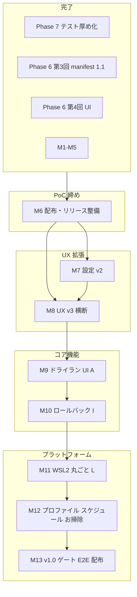

# M6–M13 マイルストーン全体設計（ロードマップ）

**記録日**: 2026-05-19  
**起点リリース**: `v0.3.0-poc`（Phase 7 テスト厚め化 + 第4回 UI + M1–M5 完了）  
**関連**: [M1–M5 実装ログ](./M1-M5-implementation-log.md)、[仕様書.txt](../../仕様書.txt) §9、[UI 再設計メモ](../dmig-ui-redesign-v0.1.md)

---

## 現在地（完了済み）

| ブロック | 内容 | 備考 |
|----------|------|------|
| Phase 7 | 中断・再開のテスト厚め（19 → 44 件規模） | `0.3.0-poc` CHANGELOG |
| Phase 6 第3回 | manifest 1.1 / `partialState` / 再開 UI | 正本 `docs/dmig-manifest-1.1.md` |
| Phase 6 第4回 | UI A → F → C → E → D（Step B 撤回） | 三層: Overview / Help / Footer+Indicator |
| M1–M5 | リリース整備・設定最小・UX v2・smoke | コミット `1983681` |

`CHANGELOG [Unreleased]` は空。次バージョンはマイルストーン着手時に積む。

---

## ロードマップ（依存関係）

---

## マイルストーン一覧

| # | 名称 | 目的 | 主な成果物 | 依存 | 状態 |
|---|------|------|------------|------|------|
| — | Phase 7 | 中断・再開のテスト厚め | fixture + main テスト拡充 | R3 | **完了** |
| — | 第4回 UI | 地図・辞書・コンパス・現在地 | Overview / Help / Footer / Indicator | A | **完了** |
| — | M1–M5 | PoC 仕上げ | 設定最小・Lucide・smoke・`v0.3.0-poc` | 第4回 UI | **完了** |
| **M6** | 配布・リリース整備 | PoC を触れる形で固定 | GitHub Release、`build:win`、smoke 運用 | M1–M5 | **一部残** |
| **M7** | 設定 v2 | Step B 代替の完成 | theme / i18n、`defaultExportDir` 実運用配線 | M3 | 未着手 |
| **M8** | UX v3（横断） | M4 見送り分 | Footer 動的 CTA、ログビューア、Lucide 拡張 | M4 | 未着手 |
| **M9** | ドライラン UI（A） | 仕様 S4 を GUI 統合 | Validator / preflight 横断 UI | コア一部あり | **部分** |
| **M10** | ロールバック（I） | 仕様 S12 | `rollback.json`、Import 後ロールバック UI | M9 推奨 | **未実装** |
| **M11** | WSL2 丸ごと（L） | Windows 専用 | 仕様書 Phase 8 | M10 前後可 | 未着手 |
| **M12** | 運用拡張（C/D/N） | プロファイル等 | 仕様書 Phase 9 | M11 以降 | 未着手 |
| **M13** | v1.0 ゲート | 製品化 | Playwright E2E、インストーラ、ユーザードキュメント | M6–M12 | 未着手 |
| — | Phase 11+ | Extension 化 | Docker Desktop Extension | v1.0 後 | 将来 |

---

## M6 — 配布・リリース整備

| 項目 | 内容 |
|------|------|
| スコープ | GitHub Release 本文（バイナリなし可）、`build:win` 手動/CI、smoke 手順の定着 |
| 既存 | `scripts/run_smoke_check.py`、タグ `v0.3.0-poc`、`docs/testing/smoke-checklist.md` |
| 判断 | [D-002](./M1-M5-implementation-log.md) Release 本文 |

---

## M7 — 設定 v2

| 項目 | 内容 |
|------|------|
| スコープ | テーマ、言語（`i18next` 既存）、`defaultExportDir` を Export/Compose で既定利用 |
| スコープ外 | Step B ウィザード復活 |
| 現状 | M3: `SettingsPage` + `dmig-settings.json`（`restoreLastPage` / `lastPage`） |
| 判断 | [D-003](./M1-M5-implementation-log.md) 拡張 |

---

## M8 — UX v3（横断）

| ID | 内容 | 優先度目安 |
|----|------|------------|
| D-004 | Compose 選択 → Footer CTA を `export` に動的切替 | 中 |
| D-005 | 共通ログビューアページ | 低〜中 |
| — | Lucide を作業ページへ（D-007 は Sidebar のみ） | 低 |
| — | `resume` の `flowStep` 要否（実装は source index 3、Step E 案はなし） | マスター判断 |

---

## M9–M10 — 仕様書 §9 との対応（Phase 番号の整理）

仕様書 §9 の **「Phase 6 = ドライラン・ロールバック」** と、実績の **「Phase 6 = manifest 1.1 + 第4回 UI」** は番号が重複している。以降の機能マイルストーンでは **A / I を M9 / M10** と明示する。

| 仕様書 Phase | 機能 | マイルストーン | 現状メモ |
|--------------|------|----------------|----------|
| 6（表） | A: ドライラン | **M9** | `dmig:preflight`・Compose 利用あり。S4 横断 UI は未整備 |
| 6（表） | I: ロールバック | **M10** | `rollback` コード・UI なし |
| 8 | L: WSL2 | **M11** | Phase 7 計画書「次は Phase 8」 |
| 9 | C/D/N | **M12** | プロファイル・スケジュール・お掃除 |
| 10 | E2E・インストーラ | **M13** | D-006 は M5 で App 統合テスト採用 |

---

## 三層 UX の完成度

| 層 | 役割 | 状態 | 次 |
|----|------|------|-----|
| Overview | 地図 | 完了（C） | — |
| Help | 辞書 | 完了（F） | — |
| Footer | コンパス | 完了（E）+ M4 Docker 案内 | M8 D-004 |
| StepIndicator | 現在地 | 完了（D）+ M4 | `resume` flowStep 要否 |
| Settings | 環境 | 最小（M3） | **M7** |

---

## 推奨着手順

1. **M6** — 配布確認（コスト小）
2. **M7 または M8** — 体感 UX なら M8（D-004）、設定なら M7
3. **M9 → M10** — 仕様の未完了コア（A / I）
4. **M11 以降** — プラットフォーム・v1.0

各マイルストーン着手時は **設計 → `docs/milestones/` 記録 → 実装 → 開発日記**（M1–M5 と同型）。指示書は `docs/instructions/` に Step 単位で起こす。

---

## 変更履歴

| 日付 | 内容 |
|------|------|
| 2026-05-19 | 初版（チャットで合意した全体設計を文書化） |
